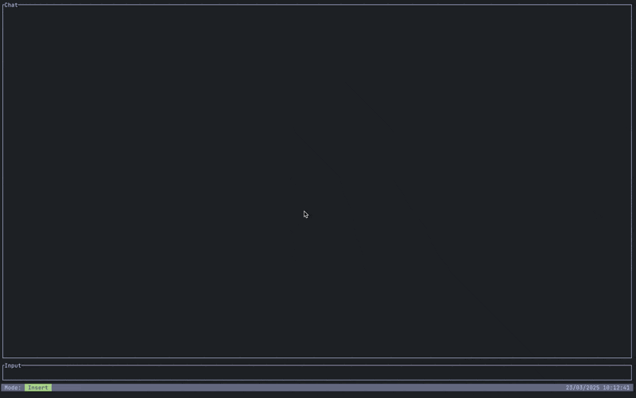

# nixcode-ai

A terminal-based client for interacting with Large Language Models (LLM), with a focus on Claude AI.

## Overview

nixcode-ai is a Rust-based TUI (Text User Interface) application that provides a modern, terminal-friendly interface for
interacting with LLMs, particularly Anthropic's Claude models. It aims to provide a streamlined, efficient interface for
AI assistance right in your terminal.



## Features

- Terminal-based chat interface built with [ratatui](https://github.com/ratatui-org/ratatui)
- Vim-inspired input modes (normal, insert, command)
- Streaming responses from Claude AI
- Tool invocation framework allowing AI to use external tools
- Command popup for executing special commands
- Configurable via external TOML configuration files

## Todos

- [x] Vim-inspired input modes
- [x] Terminal-based chat interface
- [x] Anthropic API integration
- [x] Simple tool invocation framework
- [x] Basic command popup
- [x] External configuration file support
- [ ] OpenAI API integration
- [ ] OpenRouter API integration
- [ ] Groq API integration
- [ ] Customizable keybindings
- [ ] More tools for AI interaction
- [ ] Improved tool invocation framework
- [ ] **Autonomous AI Agent that will run independently on the server as a closed service in a separate environment (
  communication via issues/pull requests)**

## Requirements

- Rust 2021 edition
- Anthropic API key (set as `ANTHROPIC_API_KEY` environment variable or in config file)

## Installation

```bash
# Clone the repository
git clone https://github.com/yourusername/nixcode-ai.git
cd nixcode-ai

# Build the project
cargo build --release

# Run the application
cargo run --release
```

## Configuration

nixcode-ai can be configured using TOML configuration files. Configuration is read (if present) from:
1. User-level config: `~/.config/nixcode/config.toml` (Unix) or `%APPDATA%\nixcode\config.toml` (Windows)
2. Project-specific config: `.nixcode/config.toml` in the current project directory

A sample configuration template is provided at `config.toml.example`. You can copy this to the appropriate location to customize your settings.

Example configuration:
```toml
[llm]
default_provider = "anthropic"

[providers.anthropic]
api_key = "${ANTHROPIC_API_KEY}"
default_model = "claude-3-haiku"

[providers.openai]
api_key = "${OPENAI_API_KEY}"
default_model = "gpt-4o-mini"
```

You can use `${ENV_VAR}` syntax to reference environment variables in configuration values.

If no configuration file is found, sensible defaults will be used, and the application will look for API keys in environment variables.

## Project Structure

The project is organized as a Rust workspace with the following components:

- `apps/nixcode-cli`: The main CLI application
- `libs/llm_sdk`: SDK for interacting with LLM providers
- `libs/nixcode`: Core library with tools and utilities
- `libs/nixcode-macros`: Procedural macros for the project

## Usage

```bash
# Run with default settings
cargo run --release

# Make sure to set your Anthropic API key (if not in config)
export ANTHROPIC_API_KEY="your-api-key-here"
```

## Input Modes

The application uses vim-inspired input modes:
- **Normal mode**: For navigating chat history
- **Insert mode**: For typing messages to the AI
- **Command mode**: For executing special commands

## Tools

nixcode-ai includes a tool framework that allows the LLM to invoke functions. Currently implemented tools:

- File globbing: Search for files matching patterns

## License

This project is licensed under the terms found in [LICENSE.md](LICENSE.md).